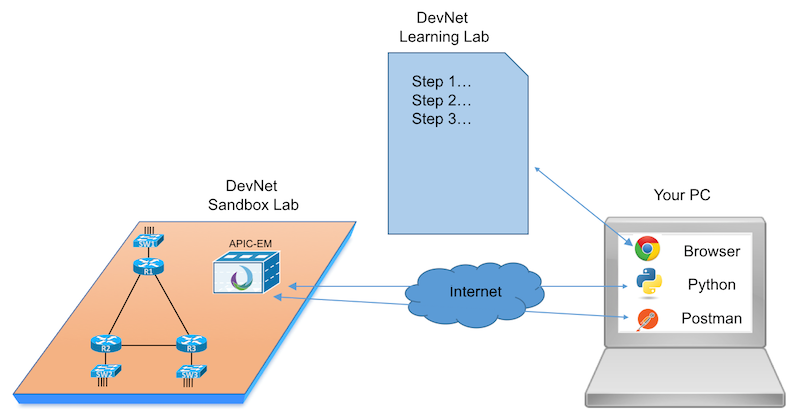
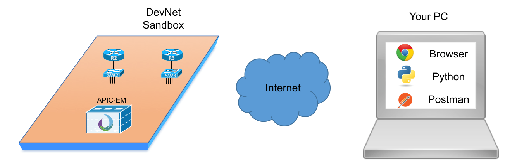
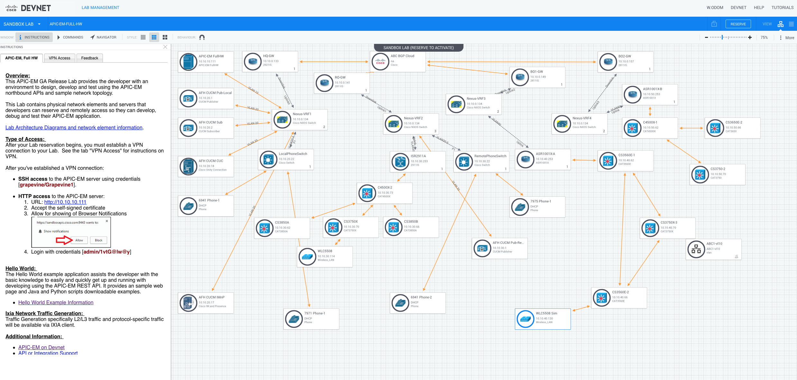

# APIC-EM Home Lab Decision, Software, and Networking Devices
Should you install APIC-EM in your home lab? And if you do, what software and networking hardware do you need to make APIC-EM useful at home? 

## Why/Wherefore to Use APIC-EM for Learning in Lab
### Objective
Completion Time: 25 minutes

- Identify APIC-EM learning options at DevNet and other related services
- List pros and cons for adding APIC-EM to your home lab
- Understand APIC-EM software and app options
- Understand and find the different lists of supported Cisco networking devices, based on the different APIC-EM apps 
- Begin the analysis of your own lab gear’s usefulness to be used with APIC-EM once installed

### Prerequisites
To perform this DevNet Learning Lab, you need only yourself and a web browser with Internet connectivity.
 
### Your Home Lab, APIC-EM, and Network Programmability
Networkers have been building their own home labs for many years, typically for building their skills, or for getting ready for certification tests. You will hear of people borrowing gear from work to bring home, or buying older (cheaper) used gear to build their home labs. Those labs often have some routers and switches, plus the devices and software related to whatever technology that person might be studying.

Now take that a step further into the world of network programmability with Cisco products:
What should an engineer do in their home lab to make it a good learning environment for learning about network programmability? 

The DevNet Learning Labs in this DevNet Learning Track examine this question. This Learning Track will have multiple Learning Modules, each with multiple Learning Labs. This Learning Lab examines three related topics, as shown in the left side of the figure:

 

Why APIC-EM to begin this DevNet Learning Track? APIC-EM is a useful tool unto itself, but also it is particularly useful for learning about network programmability and APIs. Additionally, it works with the networking devices that many networkers are familiar with, which makes it a natural fit into a traditional networker’s skill set. Beyond that, you have some work to do before choosing whether to even bother to add APIC-EM to your home lab. If you then choose to install it, you have some analysis, planning, and budgeting to do. This module of Learning Labs looks at some of these issues. 

### Assumptions in this DevNet Learning Lab and Module 
The DevNet Learning Labs in this module make some key assumptions that drive the topics the lab examines and the topics it mostly ignores. The assumptions:

- Home not Work: The context is for your home lab, not for a lab at work that is connected to your enterprise network. While some of this Learning Lab’s discussions may be useful when building a lab at work, the home lab assumption drives the choices.  
- Low Cost: For anything that requires purchase, the prices should be at least possible for an individual’s budget rather than a company’s budget.
- Licenses: Look for options that allow permanent use or trial use of software for free.
- Your Motivation: Personal learning and certification learning.
- Primary Learning Goal: This Learning Lab assumes your primary interest is network programmability. APIC-EM as an end to itself may be a close second.

###  Is This You?
In short, this Learning Lab expects that you want to obtain APIC-EM software, run it on some server, and use it with your home lab’s network. The end goal? Learning – about APIC-EM itself, its northbound APIs, and about programming to use those APIs. If that sounds like you, read on!

## Learning Programmability and APIC-EM with Existing DevNet Learning Labs
If your goal is to learn about APIC-EM, its APIs, and about network programmability using APIC-EM, then installing APIC-EM at home is probably your fourth or fifth step in that process. You should start by learning what you can using other free tools, and then deciding whether you want to install it in your home lab. For some people, you may learn all you care to learn without taking the time and expense to install APIC-EM at home. 

Simple enough. 

So, the first step in thinking about adding APIC-EM to your home lab is to think about whether you need to bother or not. The next page of this Learning Lab details some of those learning options in case you’ve not seen them before.

### Network Programmability Learning Track
DevNet organizes many of the Learning Labs into learning tracks. Each Learning Track groups related Learning Labs, and orders them in a useful sequence. 

 
For instance, the Network Programmability Learning Track has several APIC-EM labs. To see the various Learning Tracks:
1.	Browse to Developer.cisco.com
2.	Choose the top menu item “Discover”, and choose “Learning Tracks”
That process should navigate your browser to a page similar to the one shown in the next figure, from which you could select the Network Programmability Learning Track.

 
### All APIC-EM Labs
You can also navigate to any DevNet Learning Lab directly, ignoring the Learning Tracks. For instance, to find labs tagged as having some APIC-EM content, you can:
1.	Browse to learninglabs.cisco.com/labs,  https://learninglabs.cisco.com/labs and then either:
a.	Type “APIC-EM” in the search box in the upper right
b.	Click category “APIC-EM” on the left
The next figure points out the locations.

 
### What You Get with Existing DevNet Learning Labs about APIC-EM
Each of these DevNet Learning Labs gives you a sequence of scripted steps to help you learn something useful, typically in around 20 minutes. Think of them like lab exercises in a class, but also with enough material from the course (words and figures) to go along with the lab activities so that you can do the lab by yourself without any help. 

Some of the strengths of the Learning Labs are:

- Always On: Some of the Learning Labs (and many of the labs about APIC-EM) use an Always-on Sandbox Lab, so that you can do the lab any time, without a need to schedule them.
- Interact from Your Own PC: Many Learning Labs will have you install some tools on your own home computer (which is great for learning)
- Uses DevNet Sandbox Labs: Note that Learning Labs – that is, the lab exercises often use DevNet Sandbox Labs – that is, pods of real/virtual/simulated network device instances – as the lab network on which to perform the lab exercise. (More on DevNet Sandbox Labs coming next!)

## Learning Programmability and APIC-EM with Existing DevNet Sandboxes
After learning some of the basics in some Learning Labs, most of us then want to go beyond scripted learning: we need a place to have more free play to experiment with different features and functions. DevNet Sandboxes provide just that.

DevNet Sandboxes are lab pods, with both real and virtual instances of various devices, available to anyone can learn and perform experiments. All you need to do is access the Sandbox, first from your web browser, and then sometimes with other tools. The Always-On Sandboxes allow immediate access, whereas Reservation Sandboxes require prior scheduling, particularly those Sandboxes that include real and virtual device instances. 

 
The learning sequence of starting with DevNet Learning Labs, followed by using DevNet Sandboxes, makes perfect sense. You follow the scripted Learning Labs until you feel more comfortable. Then, find a DevNet Sandbox with the related hardware and software, and try your own learning experiments.

DevNet supports several APIC-EM Sandboxes. For instance, at the time this lab was first published, these APIC-EM Sandboxes were available:
Database Only, Always On: A Sandbox that uses a database instead of lab gear, with an instance of APIC-EM. You can always access this APIC-EM, and do a subset of functions and API calls. The database option is a method used to create a lab that does not rely on real network device instances, so that the Sandbox can always be available. 

- Database Only, Reserved: Same idea as the previous Sandbox, with the ability to reserve a timeslot.
- Hardware Minilab 3: A Sandbox with a small lab pod with three or four switches and a few hosts, with an APIC-EM instance, accessed via a VPN connection to Cisco
- Hardware Minilab 4: Like Hardware Minilab 3, with a slightly different mix of devices
- Full Hardware Lab: Again, APIC-EM with a lab, but with an extensive lab, with 30-40 nodes shown. Some are phones, CUCM, other routers and switches, some hosts. 

You can see details about each of the Sandboxes, even without reserving them, at DevNet. For instance, to see details about the full hardware lab, just [click this link](https://devnetsandbox.cisco.com/RM/Diagram/Index/27e2460c-52e9-4f9e-9e2a-7792f1d106d2?diagramType=Topology "Hardware Lab Topology").  

The next figure shows the topology for this Sandbox, with each rectangle with a circle inside representing some device.

To navigate to the DevNet APIC-EM Sandboxes, you can start at developer.cisco.com, navigate to the Sandbox area, and look for networking Sandboxes. To get there directly and more quickly:
https://devnetsandbox.cisco.com

Once logged in at the page for devnetsandbox.cisco.com, you should see a screen like the next figure. To find the APIC-EM Sandboxes, you can:

- Search for APIC-EM
- Click the Networking category

 
 
## Other APIC-EM Learning Options
Before moving on, you should know about two other useful free resources, both described briefly on this page.

### Cisco dCloud
The Cisco Demo Cloud, or dCloud, provides a service for demonstrating, experiencing, and learning about some current Cisco products. At its core, dCloud provides lab pods along with scripted demo experiences. Those can be used by Cisco and Channel Partner SEs to demo a Cisco product to a customer, but they can also be used by customers to experience and learn about the product. And it is a free service!

As it turns out, there were not any demos specific to APIC-EM at the time this Learning Lab was released, but you might look there for other related topics, or for demos released after this Learning Lab was released. To learn more about dCloud, and to search for demos and labs, go to:
[https://dcloud.cisco.com](https://dcloud.cisco.com)

### Blogs, Communities, and Other Options
You will probably want to track and use a few other resources as well. In particular, Cisco’s Adam Radford of DevNet frequently presents at DevNet events, Cisco Live, as well as writing blog posts and answering community questions about APIC-EM. If you care to learn a lot about APIC-EM and using its APIs, watch for [Adam’s content](https://communities.cisco.com/people/aradford/content)!  The following list provides some links to help you find Adam’s content as well as several other useful sites:

Adam’s [blog posts](https://communities.cisco.com/community/developer/dna/blog?start=0) are often linked from DevNet’s main APIC-EM page, and all his blogs can be found [here](https://communities.cisco.com/people/aradford/content).

Search for previous Cisco Live presentations about APIC-EM here at the [Cisco Live On Demand](https://www.ciscolive.com/online/connect/publicDashboard.ww) page.

Communities – join in and subscribe to the [Network Programmability study group](https://learningnetwork.cisco.com/groups/network-programmability-study-group) and the [DevNet APIC-EM community](https://communities.cisco.com/community/developer/apic-em). (Check out all [DevNet Communities here](https://developer.cisco.com/site/coi/).)
Learning at Cisco continues to offer free webinars about many topics, with an entire series about SDN and network programmability – [check out the recorded sessions](https://learningnetwork.cisco.com/community/learning_center/sdn_recorded_seminars).   

## Exercise: Assess What You’ve Done So Far
Objectively, how much have you personally learned so far with all these free learning options? The argument made here is to learn as much as you can for free, and then consider whether to add APIC-EM to your home lab. How are you doing on your learning? This exercise asks you to slow down for a moment and do a little self-assessment.

### Check Your Progress on One of Two DevNet Learning Tracks
One easy and useful place to check is to check your progress on one of two overlapping DevNet Learning Tracks. Each Learning Track lists a series of Learning Labs that make sense to do in that sequence. In some cases, a Learning Lab might be useful inside multiple Learning Tracks, so the Learning Tracks overlap. Some of the best foundational APIC-EM programmability labs happen to be part of two overlapping DevNet Learning Tracks, as shown in this figure.

 
Your job: assess your progress through one or the other of these two DevNet Learning Tracks. To do so, first open the page for a learning track. Then look at the status information on the page, as highlighted with the arrowed lines in the following figure. The highlighted items show information that tells you whether you have never started, started but not finished, or finished a Learning Lab, and when you last used the Learning Llab if you’ve started it.

- The [Network Programmability Learning Track](https://learninglabs.cisco.com/tracks/netprog-eng)    
- The [APIC-EM Programmability Learning Track](https://learninglabs.cisco.com/tracks/devnet-beginner)    

 
Once you see the information on the page, wherever you keep your notes about what you are learning for network programmability, make notes as shown in this table. Then make a to-do in your planner on when to come back and do the Learning Labs.

**Status: One DevNet Learning Track**

| DevNet Learning Track Name	|   |
| Number of Current Labs	    |   |
| Number You Have Started	    |   |
| Number You Have Finished	    |   |

### Check Your Progress on Using DevNet Sandboxes for APIC-EM
How much have you used the APIC-EM Sandboxes so far? Have you used them enough to find them useful for learning? Have you used them at all?
For those of you who have not yet tried the APIC-EM Sandboxes, either plan a to-do, or take a few minutes just to access one or two Sandboxes. Here are two good starting points:

With the [Always On (Database Only) APIC-EM Sandbox](https://devnetsandbox.cisco.com/RM/Topology?c=14ec7ccf-2988-474e-a135-1e90b9bc6caf):   

- Find and bookmark the URI for the APIC-EM Always-On Sandbox. Also note the username/password. Next time, you can just open the URI from your browser and login.
- If you did the Learning Labs for APIC-EM already, you should have Postman installed on your PC. Try to make an API call to the Always-on Sandbox APIC-EM. Save any API calls in their own Postman collection for later reference.

With the Reservaton (database only) APIC-EM Sandbox: 

- Reserve the Sandbox to use it now (if available), to experience the normal flow of reserving and waiting for setup.
- You access this APIC-EM by first creating a VPN connection to the Sandbox. Work through these details so that you overcome any VPN setup issues, so that you are ready to go when reserving any of the other DevNet Sandboxes.

##  Reasons to APIC-EM at Home
Really, you can learn a lot with APIC-EM in DevNet without installing it at home. When you are thinking about whether it is time for you to add APIC-EM to your lab, think about these good reasons to install it at home: 

### Topology and Configuration Advantages
With your own home lab, you get complete control of what network devices to use, the topology to use, and the configurations. In Learning Labs, the network device configuration and topology are set. In the Sandboxes that use real/virtual network device instances, you can change the device configurations, but the topology remains the same. In short, you probably have more flexibility with the network topology and configuration in your home lab. 

### Availability Advantages
In your own lab, your own APIC-EM instance and your own network devices should be available any time you want to use them. DevNet Sandboxes do not always meet that standard. Always-on Sandboxes are of course meant to be available, but those backed by real/virtual network devices require a reservation with setup time. That may mean the lab isn’t available when you want to use it. Also, there is usually some time (estimated 30 minutes) of time for the lab automation to bring up and configure the real and virtual devices in a Sandbox, so there is some time lag there as well. 
With you own home lab, you should be able to boot your APIC-EM instance with your own lab gear anytime you like, and be up and working from a powered off state usually in about 10 minutes.

 
### Learning More Depth about Specific APIC-EM Apps
Control over the network topology and configuration means that you have more control over what each APIC-EM app is operating against. To get deeper with some apps, you will likely want more control over the network, to fine tune your experiments and to discover what the apps are doing. 

### APIC-EM Installation/Planning Learning
The DevNet Learning Labs and DevNet Sandboxes to date have installed APIC-EM for us, with a known IP address for the APIC-EM instance. In contrast, installing at home means that you get to learn about the installation process and you also get to think about the APIC-EM server hardware requirements. By planning for and installing APIC-EM at home you get to learn the particulars of the installation, something that you would not get to do in a normal Learning Lab or Sandbox. 

### Do You Feel the Need for APIC-EM at Home?
Are you ready to get started adding APIC-EM to your home lab? Or at least ready to begin some real analysis of what it would take? Great! The rest of this Learning Lab looks at two broad topics to consider: The APIC-EM software, and the networking device instances you need to have in your home lab so that they work well with APIC-EM.

## Software: APIC-EM in Your Home Lab
The best news about adding APIC-EM to your home lab is that you can download APIC-EM for free, fully licensed. This page walks through the basics, but literally, you could be downloading all the software you need with about five minutes of navigating at Cisco.com. 

###  Downloading APIC-EM Software
Cisco delivers APIC-EM software as a disk image – an ISO    https://en.wikipedia.org/wiki/ISO_image   – that you download from Cisco’s support site. As a result, the process is simple: You find the latest release (or the release that you want), click a few times, and wait while the large file downloads.

[Download APIC-EM Here](https://developer.cisco.com/fileMedia/download/ff4eb410-6a49-40b7-ba27-ce4685c54254)!  

As for the version to download, the right answer will vary over time. So far, Cisco has released about three new versions of APIC-EM per year. Additionally, some Beta versions of different apps may appear over time as well. So, if unsure of a good version to use, you might try asking in the DevNet APIC-EM forum for recommendations. However, given that you are installing it in a home lab, you can just pick the latest release that is clearly not a Beta version of the code. 

You can get to the download page by:
1.	Navigating to cisco.com from your browser
2.	Choosing Support… downloads from the title menu
3.	Searching on “APIC-EM”

The next figure shows a copy of an APIC-EM download. Of note, the user had clicked for version 1.4 on the left, which revealed the list of downloadable images on the right. The user was hovering over one image, causing a pop-up window to give more detail. Of course, clicking the download button on the right initiates the download.

  
###  APIC-EM Apps and Licenses
The APIC-EM ISO, to date, includes most of the apps. That is, you download the ISO, install from the ISO, and most all the apps are installed as part of the process. These included apps, called Basic Apps in Cisco’s licensing documents, are licensed and require no action on your part. The figure shows the Basic Apps available as part of the APIC-EM 1.4.x releases:

### A Brief Word on the IWAN App
For licensing purposes, Cisco categorizes APIC-EM apps as: 
- Basic Apps
- Solutions Apps

The basic apps ship with the APIC-EM ISO and require no license. The solutions apps do require licensing to be used legally. The one Solution App so far (as of APIC-EM 1.4.x) is the IWAN app. (Note that you can separately download the IWAN app from the same download pages.)

This Learning Lab does not get into the detail of the licensing on the IWAN app, in part because there is much to the story, and that story has much more to do with IWAN than APIC-EM. However, here are some good references if you care to read more:

- [APIC-EM Licensing doc](http://www.cisco.com/c/en/us/td/docs/cloud-systems-management/application-policy-infrastructure-controller-enterprise-module/1-1-x/hardware-guide/b_apic-em_hardware_install/b_apic-em_hrd_install_appendix_01010.pdf)
- [APIC-EM Licensing PDF presentation](http://www.cisco.com/c/dam/en/us/products/collateral/cloud-systems-management/prime-infrastructure/presentation-c97-735996.pdf)
- [Cisco IWAN launch page](http://www.cisco.com/c/en/us/solutions/enterprise-networks/intelligent-wan/index.html)

###  Exercise: Download APIC-EM ISO and Signature File
If you are marching towards APIC-EM installation, you may as well go ahead and download two key files, even before getting into the planning process. Here are some quick steps:

- Go to the download site [here](https://developer.cisco.com/fileMedia/download/ff4eb410-6a49-40b7-ba27-ce4685c54254).  
- Find the latest generally-available release (or choose your preferred release)
- Download the ISO file (probably in the 4 GB size range or more)
- Also download the matching signature file
- Once downloaded, set these two files aside in a directory where you can find them once you begin the installation process. 

##  Lab Networking Devices – Beginning Your Analysis

Of the main three decision points about whether to put APIC-EM into your home lab – APIC-EM software, APIC-EM server hardware, and your lab’s network devices, your planning and decisions related to your lab networking devices will require the most work on your part. The last several pages in this DevNet Learning Lab examine the issues and give you the key parts of the puzzle so that you can begin the work of analyzing your lab gear. After that analysis, you should be able to answer questions like: 

- What devices in my current home lab are good enough to be useful with APIC-EM once installed?
- Where lacking, what could I do to upgrade existing gear to be useful with APIC-EM?
- Where lacking, what other devices that work with APIC-EM could I use to round out my lab?
Answering those questions requires a little more examination than just looking at one list – albeit a long list – of devices compatible with APIC-EM. 

### The Issue of Compatibility
Pause for a moment and think about the long history of Cisco and their networking products. That roughly 30-year history includes a large variety of product areas, many product families in each product area, and countless specific device models.

And then think of the task of creating one software package that centralized control of many of those products, products from over the long history of Cisco, and creating one consistent API to access information about those products.

The goals that drove Cisco to give us APIC-EM were both broad and deep. One way Cisco could have made their job much easier would have been to require all its customers to buy newer gear with later and consistent OS versions – but Cisco did not require that. However, at the same time, if Cisco had attempted to support (and test) all their historical device families for APIC-EM – particularly older devices and OS versions – the product may have never reached the market. Certainly, making APIC-EM support all Cisco products from throughout its history would have been ridiculous.
What does that mean for us when thinking about our networking gear and whether it will work with APIC-EM? Here are some key points which we will explore in the coming pages:

- Cisco publishes lists of compatible hardware and software – that is, hardware and software combinations Cisco believes work with APIC-EM.
- Based on experience, some other non-listed hardware does work for some APIC-EM features and apps
- For home labs, note that many of the older network devices (and therefore cheaper in the used market) are not in APIC-EM’s compatibility lists.

As a result, the devices and software levels listed in the compatibility lists do not include some of the older of the cheaper home lab device options. The figure shows a few of the more common options for enterprise router and switch families.

  
### Where to Begin Your Own Lab Analysis: Network Visibility Compatibility List
To get started, go ahead and open another browser tab to look at [this document](http://www.cisco.com/c/en/us/td/docs/cloud-systems-management/application-policy-infrastructure-controller-enterprise-module/1-4-x/network_visibility/supported-platforms/b_netvis_supported_devices_1-4-x.html#concept_t2v_zff_5y). Search for the section that lists long tables of compatible hardware, just a few pages into the document.
That document details compatibility information about the APIC-EM app called the “Cisco Network Visibility Application”. This app can be a little difficult to find sometimes, because it does not show up as a separate single app in the APIC-EM GUI. In fact, none of the icons in the APIC-EM GUI go by that name. That app name references a few of APIC-EM’s core features, particularly the Discovery and Topology apps, as shown in the figure.

The compatibility list for the Network Visibility App serves as the best baseline list for device compatibility with APIC-EM. Why? Many of the features of APIC-EM apps rely on the topology information discovered by the discovery function, as stored in APIC-EM’s Network Information Database. APIC-EM uses the database as the basis for displaying the topology, as well as for knowing what devices it might operate against for some other apps, like EasyQoS. 

Now back to the question of whether your lab hardware meets requirements. The starting point in that comparison is to look at the devices supported by the APIC-EM Network Visibility Application. Take the list, and then get into each of your devices and check the actual model numbers and OS versions.

### Exercise: Compare Your Gear to the Network Visibility Application Compatibility List
Your first exercise then is somewhat obvious. You want to start answering those questions, and completing some notes akin to the types of information in the following table:

| Lab Device Name | Lab Device Model | Supported? [^2] | If No: Actions that would Make it Compatible? | If No: Possible Replacement Model? |
| --- | --- | --- | --- | --- |
|   |   |   |  |   |
|   |   |   |   |   |
|   |   |   |   |   |
|   |   |   |   |   |					
				
[^2]Answers question of whether the device is supported per the APIC-EM Network Visibility App Compatibility List (APIC-EM Version ____).

Before you get started with the work, if you are doing these activities as you move through the lab, here is some advice:

- Find the now-current compatibility list for the Application Visibility and Control app. As you might expect, that document may change for each successive APIC-EM release.
 - Use this link to find the [APIC-EM documentation page](http://www.cisco.com/c/en/us/support/cloud-systems-management/one-enterprise-network-controller/tsd-products-support-series-home.html)  
 - Look for documents labelled “Compatibility Information” and/or “Release Notes”.
- The most likely action to make your existing lab gear become compatible would be to upgrade the OS version (IOS, IOS XE, etc.). Don’t forget to check for RAM/Flash requirements (see the [Cisco Feature Navigator](http://www.cisco.com/cfn)). 
- Because you will likely revisit this task a time or two, allow yourself to move on rather than get bogged down trying to figure out whether you can upgrade a single device. 

## APIC-EM’s Myriad Compatibility Lists
In some ways, APIC-EM is an application, but in others, it is a platform for applications. When thinking about your lab gear, and whether it is compatible with APIC-EM, you should think about it in terms of apps, and what that compatibility gives you. This page explores some of the apps and their compatibility lists.

The main point is that each app may (and often does) have its own list of compatible hardware and software. In some cases, the lists are close to the list for the Network Visibility app’s compatibility list, while in other cases the subset is much smaller. The lists are subsets of the lists seen for the Network Visibility app, as depicted in this figure.

   
This page works through some of the reasons.

###  Path Trace Application

The Path Trace Application allows the user to supply a source and destination, with the application then showing the path a packet would take from that source to the destination. In the GUI, Path Trace creates a linear drawing with the source on the left and the destination on the right.

The app has its own list of compatible hardware and software. First, this app relies on the Network Information Database as discovered by the APIC-EM Network Visibility Application. Then, it examines the forwarding tables of the actual devices in the network, predicting what entries would be matched by those tables.

As it turns out, this app’s list of compatible devices closely matches the list of devices supported by the Network Visibility Application. Many of the same devices are listed, but with more recent OS versions. Check this [link ](http://www.cisco.com/c/en/us/td/docs/cloud-systems-management/application-policy-infrastructure-controller-enterprise-module/1-4-x/path_trace/supported-platforms/b_path_Supported_Platforms_1_4_0_x.html) 
to find the compatibility list for this app, as of the time this Learning Lab was posted.

###  EasyQoS App

The EasyQoS application, like the Path Trace application, has its own separate compatibility list. The list is again a close replica of the list for the Network Visibility application, with different details. 
The app deploys QoS configurations to devices, based on Cisco’s best practices per Cisco’s QoS Design Guides. As a result, the QoS app omits a few devices (for example, ASA firewalls) found in the compatibility lists for the Path Trace and Network Visibility apps. It also lists some extra details – for instance, while few of you will likely have Cisco 6500 or 6800 switches in your home lab, note that the compatibility document does detail support by line card in those switches, because QoS features can differ in different line cards.

Check out the [compatibility guide for the APIC-EM EasyQoS app](http://www.cisco.com/c/en/us/td/docs/cloud-systems-management/application-policy-infrastructure-controller-enterprise-module/1-4-x/easyqos/supported-platforms/b_EasyQoS_Supported_Devices_1_4_0_x.html#concept_t2v_zff_5y) for more specifics.   

### Intelligent WAN (IWAN) App
Intelligent WAN, or [IWAN](http://www.cisco.com/go/iwan ), creates a Software-Defined WAN (SD-WAN) solution. It uses several Cisco product features, which makes the configuration a bit challenging at times. The IWAN app helps solve that problem by helping you configure IWAN features by using a series of configuration panels from the IWAN app GUI. 

The list of supported devices for the IWAN app is more a statement of what platforms and OS versions support the IWAN features. For instance, the following documents include the list of compatible devices for IWAN 2.2 and then for the APIC-EM IWAN app (V1.4.x). If you put them side-by-side, you’ll see that the supported device list for the IWAN feature is the same list as the supported devices for the APIC-EM IWAN app.

- [IWAN 2.2 Release Notes](http://www.cisco.com/c/en/us/td/docs/solutions/Enterprise/Intelligent_WAN/release/notes/iwanrn-2-2.html#pgfId-119828)  
- [IWAN App 1.4.2 Release Notes](http://www.cisco.com/c/en/us/td/docs/solutions/Enterprise/Intelligent_WAN/release/notes/1-4-2/iwan-release-notes-1-4-2.html)   

### Impact on Your Home Lab Analysis
Remember that original set of questions about your home lab gear? Armed with this kind of information, you need give some thought to what parts of APIC-EM are most compelling to you. If you get APIC-EM working so that discovery works, is that enough for you? In that case, the topology and device parts of the API should work, which lets you practice some API calls. Or if you also want Path Trace, and/or the EasyQoS app and its APIs available, how does your lab gear stack up?

To answer those questions, you should first find any updated compatibility lists as follows:

- Navigate to the [APIC-EM documentation](http://www.cisco.com/c/en/us/support/cloud-systems-management/one-enterprise-network-controller/tsd-products-support-series-home.html).   
- Find the documents for the latest version of APIC-EM.
- Open new browser tabs for both the “Compatibility Information” and “Release Notes” categories; some apps list their compatibility info in release notes, some in the compatibility docs.

Now you have some work to do, as outlined in this closing exercise.

### Exercise: Assess Your Lab Gear Vs. APIC-EM Apps
For this exercise, you will again probably do some work, and then come back to revisit again as you work to prepare your lab. So, find a place to take your notes where you will not lose the notes later. Here are some suggested steps:
- Think about the existing APIC-EM apps, and decide which you must support in your home lab, which you would like to support, and which are just nice to have
- Make a table list the table below, listing the apps
- Find the compatibility list for each of the apps you care about
- Work through each of the devices in your lab, and determine if it is in the compatibility list, or if with an upgrade, it could meet the requirements of the compatibility list.

| Lab Device Name | Lab Device Model | Network Visibility App  | Path Trace App | Your App Here… | Your App Here… |
| --- | --- | --- | --- | --- | --- |
|   |   |   |   |   |   |
|   |   |   |   |   |   |
|   |   |   |   |   |   |
|   |   |   |   |   |   |
			

## Summary
To close out this DevNet Learning Lab, this summary page hits some highlights and makes a few conclusions.

###  Network Devices: Strong Overlap in Supported Device List for Many Apps
While each app has its own list of compatible network devices, the lists for several apps list the same models of network hardware, particularly for these apps:

- Network Visibility
- Plug and Play
- EasyQoS
- Path Trace

As a result, you may have a home lab, or can build a home lab, which has a good combination of hardware and software that works with many of the APIC-EM apps. That fact enables much of the API to have meaningful data, because to make the API branches populate with meaningful data, the matching app features must work – and many of those functions require a working network device to operate against.

###  Some Older Devices Work for Some Apps
Some apps work with older network devices and OS versions. The compatible device lists discussed in the latter parts of this Learning Lab focuses on the compatible devices, but some devices and OS levels still work. In fact, much of the testing done related to this Learning Lab purposefully used:

- ISR G1 routers (1841’s)
- 2960 switches

Note that with these older devices and OS versions, the Network Visibility functions (discovery and topology) worked well. However, EasyQoS would not even attempt to configure the devices.

Why mention the fact that the older gear may work? Well, if you know you will take the time and money to install APIC-EM in your lab already, and wonder how much more money to spend on your networking hardware to make it compatible, you could get started and experiment with your older gear. Get APIC-EM installed and working, discover your home lab, and see what works. That might be a workable option to save some money.

### Server Hardware for APIC-EM
Another barrier to your decision to install APIC-EM will be the cost of the server hardware to use to run APIC-EM. The next Learning Lab in this Learning Module examines the options.

