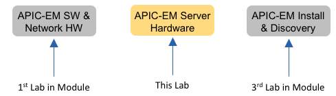
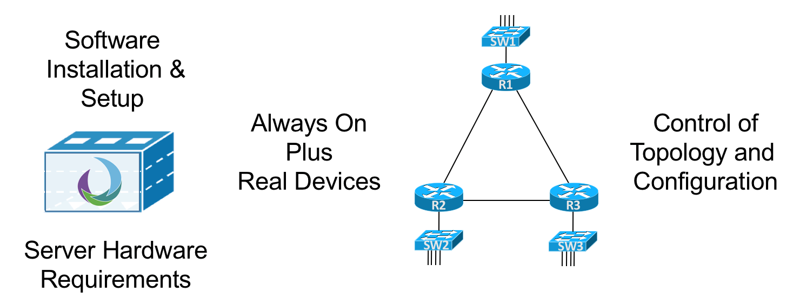

# APIC-EM Home Lab Hardware Platform

The first DevNet Learning Lab in this Module discusses some points to consider about whether to install APIC-EM in your home lab. That first Learning Lab discusses a normal learning progression of using the available free Learning Labs and DevNet Sandboxes, and then deciding when you feel like you need to add APIC-EM to your home lab. That Learning Lab then examines what you needed in your lab for APIC-EM software and for the network devices that will work with APIC-EM.

This Learning Lab in that same Module focuses on what may likely be your biggest barrier to deciding to add APIC-EM to your home lab: the cost of the server hardware on which to run APIC-EM. This Learning Lab begins with the assumption that you are at least considering whether to add APIC-EM to your home lab, including the fact that you have some budget set aside. What server hardware should you buy? What specifications? What could you choose to save some money? This Learning Lab works through some of those questions. 

 
 
This Learning Lab breaks down the APIC-EM hardware requirements. It then shows a series of hardware options, some of which may not meet all the hardware requirements, for the sake of finding a lower price point for your APIC-EM server. Along the way, we ask you to take a few minutes and begin your own research, just to see what servers you might with current prices in your part of the world.

This Learning Lab makes assumptions and choices that impact the examples shown here: 

- Home not Work: The context is for your home lab, not for a lab at work that is connected to your enterprise network. While some of this Learning Lab’s discussions may be useful when building a lab at work, the home lab assumption drives the choices. 
- Low Cost: For anything that requires purchase, the prices should be at least possible for an individual’s budget rather than a company’s budget.
- APIC-EM V1.4.1.x: Hardware requirements may change over time, of course, and Cisco releases new versions of APIC-EM 2-3 times per year. This Learning Lab happened to use the then-latest version, 1.4.1.x, and its documentation, as the basis for the hardware requirements.
- Intel Processors (Mostly): Just to make the comparisons more obvious, the discussion keeps to Intel processors for the most part (with one exception). You can look for AMD processors when doing the exercises if that is your own preference.

This Learning Lab begins with a quick recap of some of the why/wherefore about your decision to install APIC-EM at home, and then spends the rest of the space on your server hardware decision.

## Recap: To Install APIC-EM at Home, or Not?
Do you really need or want to install APIC-EM in your home lab? Even though the software itself can be downloaded for free, there is some time and money required to add APIC-EM to most home labs. 

This page recaps thoughts about your own decision of whether to add APIC-EM to your home lab, condensed from the more detailed discussion from DevNet Learning Lab, “APIC-EM Home Lab Decision, Software, and Networking Devices”. Here’s a quick recap in case you have not seen the other Learning Lab recently. 

### DevNet APIC-EM Learning Options
One reason why you might defer the choice to add APIC-EM to your home lab is that you can learn a lot at DevNet, so that you may not even need APIC-EM at home. In particular:

- [DevNet Learning Labs](https://learninglabs.cisco.com/tracks/apic-em-prog#net-controllers): Several of the DevNet Learning Labs teach network programmability using APIC-EM’s northbound REST APIs. It’s a great learning tool beyond being a great management platform. 
- [DevNet APIC-EM Sandboxes](https://devnetsandbox.cisco.com/RM/Topology?c=14ec7ccf-2988-474e-a135-1e90b9bc6caf):  DevNet also offers Sandboxes, which are lab pods with software and real and/or virtual instances of various networking hardware. The APIC-EM Sandboxes of course have APIC-EM pre-installed. 

### Reasons You Might Want to Install APIC-EM at Home for Learning
As wonderful as those DevNet and other learning tools are, the deeper you go, the more you will want to put APIC-EM in your home lab. The progression for many people is to learn APIC-EM at DevNet and eventually put APIC-EM in their lab at work (expecting to build skills and eventually move it to production), or to install it at home for self-learning. Here are some of the key reasons for wanting APIC-EM at home:

- Network Topology/Config: You control the network that APIC-EM discovers and manages.
- Availability: Your home lab should be available to you any time you want it!
- APIC-EM apps: The flexibility gained by controlling all parts of the network can enable more experimentation and learning with some of the APIC-EM apps
- APIC-EM Installation/Planning: If your goal is to learn about the install process, and some of the options, having your own server on which to install APIC-EM is a big help.

 
 
From here forward, the rest of this Learning Lab assumes you are pursuing adding APIC-EM to your home lab – let’s go find some hardware on which to run APIC-EM!

## Server Hardware Requirements for APIC-EM 
For most of us, the cost of the server will be the biggest barrier to overcome before you run APIC-EM at home. To help you work through that, this Learning Lab examines the APIC-EM server hardware requirements, and then examines a variety of options at different price points.

### Three Environments on which to Run the APIC-EM System
APIC-EM software downloads as an ISO that can be installed natively on a server (that is, bare metal), as a virtual machine, or as an appliance. If a virtual machine, the APIC-EM documents list a single supported hypervisor: VMWare ESXi. Cisco also offers an appliance option, in which you purchase the appliance from Cisco; what you receive is a Cisco UCS server with the APIC-EM product already installed on the server.

 
 
For the bare-metal option, Cisco lists the approved server hardware choices. The hardware compatibility list includes a [short list of Cisco C-series UCS servers](http://www.cisco.com/c/en/us/td/docs/cloud-systems-management/application-policy-infrastructure-controller-enterprise-module/1-4-x/install_1-4-1-x/b_apic_em_install_guide_v_1-4-1-x/b_apic_em_install_guide_v_1-4-1-x_chapter_011.html) (that is, rack mount servers). 

For the appliance, you buy the appliance, for which the hardware unsurprisingly happens to be one of the approved Cisco UCS C-series servers. For the VM option, you just download the APIC-EM installation file (an .ISO file), and install it as a VM under VMWare’s ESXi hypervisor.

### Server Hardware Requirements for APIC-EM
If you use bare-metal or a VM, you need to choose how much of each server resource to reserve for the APIC-EM system or VM. The next figure summarizes the key requirements (per the APIC-EM 1.4.1.x installation documents): 

 
 
To make the comparisons more direct and more obvious, the next few pages focus on the bare-metal installation, assuming the requirements as shown in the figure.

### Community Discussion about Your APIC-EM Server Requirements
The [installation docs ](http://www.cisco.com/c/en/us/td/docs/cloud-systems-management/application-policy-infrastructure-controller-enterprise-module/1-4-x/install_1-4-1-x/b_apic_em_install_guide_v_1-4-1-x/b_apic_em_install_guide_v_1-4-1-x_chapter_011.html#id_36793) require a given number of cores and so on. However, when you install APIC-EM on a server that has less than the required amount of resources, the installation works (with some error messages). And then APIC-EM may or may not work just fine in your home lab, which begs the question: how much CPU, RAM Disk and so on do you really need on a server to run APIC-EM in a home lab?

There may never be a single set answer to that question, but it can help to hear about other systems that people have used successfully in their labs. To that end, the following [post in the DevNet APIC-EM community]( https://communities.cisco.com/thread/82355) asks that very question. Make sure to check out the various comments to see what systems have worked for different people.

### Hardware for APIC-EM Vs. Other Lab VMs
This DevNet learning lab keeps its focus on a server to run APIC-EM on bare metal, just so the upcoming comparisons can be more direct and obvious. However, you will probably want to think about buying your server to run a hypervisor, like VMWare’s ESXi, and run multiple VMs in addition to running APIC-EM as a VM. For instance, you may want to:

- Buy a server with more power than APIC-EM needs
- Install ESXi
- Run an APIC-EM VM
- Run Cisco VIRL
- Run multiple CSR 1000v instances 

So, while working through the next few pages of this Learning Lab, be thinking about whether you might want to buy a server with more CPUs, RAM, and so on than you need for APIC-EM.

### Hardware Options Considered in this Learning Lab
The next few pages show a comparison between four reasonable options for server platforms to run APIC-EM. In particular:
1.	Approved Cisco UCS servers
2.	White box rack mount server options
3.	Mini-Desktops 
4.	Pre-Built and Build-Your-Own Desktops

## APIC-EM on Approved Cisco UCS Servers 
You can find the approved Cisco Unified Computing System (UCS) servers on which to install APIC-EM near the top of the APIC-EM Installation Guide. For reference, if you want to look for yourself:

- A [page that should list the Installation Guides](http://www.cisco.com/c/en/us/support/cloud-systems-management/one-enterprise-network-controller/products-installation-guides-list.html) for all versions 
- The [Installation Guide for APIC-EM V1.4.1.x](http://www.cisco.com/c/en/us/td/docs/cloud-systems-management/application-policy-infrastructure-controller-enterprise-module/1-4-x/install_1-4-1-x/b_apic_em_install_guide_v_1-4-1-x.html) (used to build this Learning Lab) 

### Overview of APIC-EM UCS Server Options
The APIC-EM installation guide for version 1.4.1.x lists three supported server models, as listed here. However, two of the models (the two with M3S in their names) have reached end-of-sales by Cisco, so focus on the first one in the list.

- [Cisco UCS C220 M4S](http://www.cisco.com/c/dam/en/us/products/collateral/servers-unified-computing/ucs-c-series-rack-servers/c220m4-sff-spec-sheet.pdf) 
- [Cisco UCS M3S](http://www.cisco.com/c/en/us/products/servers-unified-computing/ucs-c220-m3-rack-server/index.html) 
- [Cisco UCS C22 M3S](http://www.cisco.com/c/en/us/products/servers-unified-computing/ucs-c22-m3-rack-server/index.html) 

(Also, for reference, [this page](http://www.cisco.com/c/en/us/products/servers-unified-computing/ucs-c-series-rack-servers/models-comparison.html) shows a good comparison of different UCS C-series models.) 

In case you have not looked at Cisco servers before as part of your job, a couple of tips can help you sift through the meaning.  In the product names, note that the three listed models begin with “C”, which for Cisco UCS servers means they are rack mounted servers. (B-series servers are blade servers.) Also, all three of these models end in S, which means that they use small form factor (SFF) disk drive bays, accommodating 2.5 inch drives. Sometimes, a matching L model (long form factor, or LFF) exists, with practically the same specifications as the similar S model, other than the L model using 3.5-inch drive bays.

### Example Server Configuration that Meets All APIC-EM Requirements
You could create a configuration for a Cisco UCS C220 M4S on your own by using Cisco’s Commerce tool (https://apps.cisco.com/Commerce/guest), Or you could call your favorite Cisco reseller (or find one here: (www.cisco.com/go/partnerlocator/ )). Of course, for comparison, you can use the UCS server configuration linked here:
LINK TBD

- Model: The UCS C220 M4S chassis
- Processor: An [Intel E5-2620 CPU](http://ark.intel.com/products/64594/Intel-Xeon-Processor-E5-2620-15M-Cache-2_00-GHz-7_20-GTs-Intel-QPI).  As with all options chosen for this configuration, it was the cheapest option that met the minimum requirement (6 cores). Note that it has 12 threads.
- LAN: Two Gigabit Ethernet NICs – the C220 M4S has no LAN NICs built-in, but two PCIe expansion slots. The sample configuration adds a 2-port PCIe Gigabit NIC.
- RAM: 32 G RAM
- Disk: A 300 GB hard disk drive (HDD) with approximately 1200 MBs transfer rate. (If I were buying for my own lab, I’d buy disk with more capacity. Note that the server plenty of drive bays for later expansion.)
	
 
 
Although a popular enterprise product line, the list price of just under $10,000 of this example would probably drive away most of us thinking of using this server for a home APIC-EM installation. Even at a 30-40% discount, the price would still be too much for the average person to spend for a server to use in a home lab. However, if you’re willing to try hardware that’s not on the approved list, and maybe even hardware that does not meet all the listed requirements, you can get the price down quite a bit – so read on.

## APIC-EM on a Generic Rack Server Hardware – Example 1
This next page makes a pair of useful comparisons to the supported UCS hardware by looking at options with custom white-box rack mount servers. Using a rack mount server has some advantages in home lab, particularly if you already put most of your networking and other lab devices into a rack. A single rack unit (1U) server can have plenty of power as your APIC-EM server. And while Cisco UCS servers are hugely popular in enterprise data centers, using a white-box server in your home lab, to save a few dollars, can make good sense. The rest of this page of the Learning Lab looks at some options.

### Repeating the APIC-EM Requirements
To begin the comparisons, this page starts again with the same APIC-EM hardware requirements discussed for UCS servers. The only requirement removed for this first white-box configuration comparison is that the server itself no longer has to be a UCS server. The figure repeats the key requirements:

 

The process to find the examples for this page was straightforward. We just searched the Internet for phrases like: 

- Custom rack server
- Generic rack server

Then we looked for sites that made it easy to configure servers and compare different options, and used sites that showed the prices as well. (Note that you could also use any brand-name vendor’s web site as well, as they often sell rack-mount servers.)

### Example White-Box Configuration 1: Meets Requirements
This first example configuration attempts to meet APIC-EM requirements, but just barely meet the requirements to save the most money as possible. This first example priced out at $1950 US; the pricing was run in May 2017, and did not include taxes or shipping. The following table lists the APIC-EM requirements again, with the specifications for the priced system:

 

Beyond the details in the figure, here are a few other comments about this example system: 

- 6 Cores, 12 Threads: The CPU chosen for this system does support virtualization so that you could have 12 virtual CPUs when using a hypervisor.
- No RAID: It does not support RAID at all as configured (the earlier UCS example does support RAID.) RAID is the one literal APIC-EM hardware requirement ignored for this system, beyond the obvious fact that the server is not a Cisco UCS server.
- Two Ethernet: While APIC-EM requires one LAN adapter, for home use, you will often want two. Many rack mount servers supported two built-in 10/100/1000 Ethernet ports without additional cost. 

### Options to Consider 

Of course, for every example, there are many variations to spend or save a little money. Also, you should be thinking about how much you might expand your requirements beyond what Cisco asks for an APIC-EM system if you want to have a server to use for many purposes in your home lab. For instance, buying a CPU with 10 cores that supports virtualization for 20 threads, and buying 64 or 128G of RAM, may be worth the money in your case.

That said, in this example, here are a few examples of variations, just as food for thought:

- Save $250, more cores: Using the 8 core E5-2620v4 Processor would have saved $250, and given you 8 cores/16 threads, but at 2.1GHz base clock speed, it didn’t meet the literal requirements. 
- Add $30, more disk: Upgrading to a 1TB disk would have cost only $30.
- Add $250, 4 More Ethernet: Adding 4 x 1 Gigabit Ethernet interfaces (in 1 PCIe expansion card) would have cost about $250. 

## APIC-EM on a Generic Rack Server Hardware – Example 2
While the APIC-EM install docs do happen to list that minimum processor speed of 2.4 GHz, the clock speed of the processor is just one factor that determines the amount of work a processor can perform. You personally could spend time researching CPU benchmarks to try and find the very fastest CPU. But you also want to get on with the work of installing APIC-EM in your lab, so there is a probably a happy medium between the two. This next topic gives a little insight into the topic without taking us too far down that path.

### Comparing Processors
Given that clock speed is just one factor impacting CPU performance, the first APIC-EM requirement that you might choose to relax might be that processor speed. Rather than drag through a long discussion of benchmarks, take this example. 

Intel releases versions of their processors over time, with the later versions being improved in some ways. Sometimes, the better/later version processor has a slower base CPU clock rate. As a specific example of that, here are two processors you might come across when configuring rack mount servers are:

- [Xeon E5-2620-v3](https://ark.intel.com/products/83352/Intel-Xeon-Processor-E5-2620-v3-15M-Cache-2_40-GHz): 2.4 GHz base clock, 8 CPU cores, two threads/core. 
- [Xeon E5-2620-v4](https://ark.intel.com/products/92986/Intel-Xeon-Processor-E5-2620-v4-20M-Cache-2_10-GHz): 2.1 GHz base clock, 8 CPU cores, two threads/core.

As you might expect, the v4 processor has a better performance benchmark than the earlier v3 processor of the same series – but without the 2.4 GHz base clock rate. If you open web pages for the links for each processor, you will see a page like the one shown in the next image. Then look for the “benchmarks” item, and you can see Intel’s performance data on each processor.

 

  
If you want to do a little research on the processors, this link is a great place to look to [compare Intel processors](https://ark.intel.com/Search/FeatureFilter?productType=processors). For servers that would be in the range of what you’d use for APIC-EM, or for a more general network programmability server platform, when searching, consider filtering your search for the 6-12 core range, and probably ignore processors that didn’t support virtualization (aka that did not support multiple threads per CPU).
Of course, using a server that has less CPU per the stated APIC-EM requirements is a risk, so consider that when choosing where to spend your money on a server.

### Disk Capacity, Disk Speed, and RAM
While you might consider a compromise on the processor, for the reasons just given, it appears that the disk capacity, disk speed, and RAM numbers quoted for APIC-EM should not be relaxed. That is, meet those standards, or use more/better.

For disk, meeting the need to 200 GB and 200 MBs transfer rate should not be a problem, and not cost a lot. For hard disk drives (HDDs), the cost difference between disks of approximately 250 GB, 500GB, and 1 TB are in the tens of dollars. You can easily find HDDs that support SATA III (rated at 600 MBs transfer rate) with good price performance. And most any Solid State Drives (SSDs), along with the bus technology it uses, far surpass the 200MBs requirement. In fact, you might be better off spending on a fast SSD or two for this server.

For RAM, again, stick with 32G as your minimum. 

### Example White-Box Configuration 2: Slower Base Clock Rate
This second example configuration on the page takes those same requirements from the previous white-box rack-mount server, and removes the clock speed requirement. This example priced out at about $1700 US: $250 less than the previous example. The pricing was run during the same day as the previous pricing exercise, and did not include taxes or shipping. The following table lists the APIC-EM requirements again, with the specifications for the priced system:

 

The following table summarizes the APIC-EM requirements again, and puts the two custom rack-mount servers side-by-side for easier comparison. Note that both examples used the same RAM and Disk parts, with the only difference being the processor used. 

| Requirement | Value/ Amount per 1.4.1x Installation Docs | Custom Rack Server 1 | Custom Rack Server 1 |
| --- | --- | --- | --- |
| CPU Cores | 6 (Recommended 12) | 6 ([Intel Xeon E5-1650v4](https://ark.intel.com/products/92994/Intel-Xeon-Processor-E5-1650-v4-15M-Cache-3_60-GHz)) | 8 ([Intel Xeon E5-2620v4](https://ark.intel.com/products/92986/Intel-Xeon-Processor-E5-2620-v4-20M-Cache-2_10-GHz)) | 
| CPU Speed | 2.4GHz | 3.4 GHz | 2.1 GHz | 
| RAM | 32 GB | 32 GB | 32 GB | 
| Disk Capacity | 200 GB | 500 GB | 500 GB |
| Disk IO Speed | 200 MBs | 600 MBs ([SATA III](https://kb.sandisk.com/app/answers/detail/a_id/8142/~/difference-between-sata-i%2C-sata-ii-and-sata-iii))  | 600 MBs ([SATA III](https://kb.sandisk.com/app/answers/detail/a_id/8142/~/difference-between-sata-i%2C-sata-ii-and-sata-iii)) |
| RAID Level | 	10 | None | None |
| LAN Interfaces | 1 | 	2 x 1 Gbps RJ-45 (motherboard) | 2 x 1 Gbps RJ-45 (motherboard) |
| PCI Expansion	| 0 |  1 Full-height PCIe slot (empty)	| 1 Full-height slot (empty)|
| Price (May 2017) | - | $1950 | $1700|

### Options to Consider 
Again, there are many variations to spend or save a little money – here are a few variations that were interesting:

- Save $150, Meet Processor Requirements: We could have gotten the price down about $150 by choosing an Intel Xeon E5-2609-v4 processor. However, that processor does not support threads, and its performance benchmarks were about half of the Intel E5-2620v4 shown for this latest example. But it did meet the literal requirements (including clock rate) for running APIC-EM.
- Add $320, Get 10 Cores/20 Threads: Bumping up to 10 cores/20 threads was not a lot more money at $320, with an Intel E5-2630-v4 processor. http://ark.intel.com/products/92981/Intel-Xeon-Processor-E5-2630-v4-25M-Cache-2_20-GHz
- Add $950, Get 12 Cores/24 Threads: However, to get to 12 cores, the cheapest option added almost $1000 more to the cost. So, getting to a 10 core/20 thread server for a general-purpose programmability platform may be a good sweet spot today.

### Exercise: Build Sample Configurations for Yourself
If you are enjoying these comparisons, take time right now to begin your own research with a baseline rackmount system of your own. In your notes, build a table like the one below. Think about your own plan, following this kind of planning tasks: 

- Look to the [APIC-EM installation documentation](http://demand.cisco.com/APIC-EM_VM?elqTrackId=c4e8000f357c4ec2a841c7a581a3f377&elq=00000000000000000000000000000000&elqaid=5108&elqat=2&elqCampaignId=) to discover the current APIC-EM version and the current hardware requirements for a bare-metal installation. 
- Make your own notes about these specifications in a place where you can find them again (e.g., OneNote, Evernote, etc.)
- Search the Internet for “custom rack mount server” or similar, and browse at some of the sites until you find one that is easy to use to configure and price a server. (You can comparison shop later; for now, just find one that is easy to use.)
- Try to build a minimum system (that is, no extras) for the current APIC-EM hardware specifications, to see if your price was better or worse than what this lab’s experiment found.
- If you are thinking of buying a general-purpose server for all your network programmability learning, repeat the exercise, bumping up your CPU, RAM, etc. in your plan.

| Requirement	| Value/Amount per 1.4.1x Installation Docs | 	Your Chosen Requirements: 1	 | Your Chosen Requirements: 2 | 
|---|---|---|---|
| CPU Cores | 	6 (Recommended 12)	|  |  |	
| CPU Speed | 	2.4GHz			|  |  |	
| RAM	| 32GB		|  |  |		
| Disk Capacity	| 200 GB		|  |  |		
| Disk IO Speed |	200 MBs		|  |  |		
| RAID Level	| 10		|  |  |		
| LAN Interfaces |	1	| 	|  |  |	
	
## APIC-EM on Intel NUC Mini Desktops 
The previous page showed examples of how to get the APIC-EM server price down with generic rack-mount servers, as well as by relaxing the requirements a bit with not purchasing RAID hardware and by not using the CPU base clock rate as stated. This next page takes another step by examining mini-desktops, specifically the Intel NUC, which makes us relax the requirements even more – but with another significant reduction in price.

### How Much Processor Do We Really Need?
APIC-EM will work with less CPU than listed in the APIC-EM Installation docs, but using less CPU is a risk. The install docs list the minimum recommended system requirements. But in a home lab, if your budget was tight you might take a small risk to run an under-powered server to save your own money, hoping that your work in lab would not stress the system too much.

That strategy of course begs a question: how much hardware is enough for APIC-EM in your home lab?

First, there is a [post in the DevNet APIC-EM community](https://communities.cisco.com/thread/82355) that gives us all a place to discuss the idea of what people have used successfully for an APIC-EM home lab. We started this thread to help drive the conversation. In effect, the answer is that you can use whatever works. Hopefully, over time, that thread and others can help us all by listing people have successfully used in lab.
Also, thinking in terms of Intel’s server (XEON) and desktop/laptop Core series (I3/I5/I7), some of the Intel I3/5/7 series support several cores as well as two threads per core. In fact, the Intel I7-6770HQ    http://ark.intel.com/products/93341/Intel-Core-i7-6770HQ-Processor-6M-Cache-up-to-3_50-GHz  has 4 cores with 8 threads, and finishes well in some benchmarks compared to the XEON E5-2620v4, which was featured in one of the rack-mount servers in the previous page.

The downside? As of the time this DevNet Learning Lab was published, the Intel Core series maxed out at 4 physical cores, which does not meet the literal requirements listed for APIC-EM. But if you might be willing to try less CPU, for less money, and see if it works for your needs, it is worth looking at the options. And that is what this page examines.

### Do Not Skimp on Both CPU Cores and Disk Speed
As you might expect, there is a low enough amount of CPU, RAM, disk space, and disk speed for which any software system would simply not work at all, or work so poorly as to be useless. However, the idea with this exercise is to determine if you could save some money on a few of the requirements, could the system still work.

When discussing this idea that the RAM, disk speed, and CPU do affect each other. That is, a system with a SATA1 drive (150MBs), which is less than the suggested 200MBs, would be less tolerant of a lower-powered CPU, say in comparison to a much faster SSD drive that had a >1GBs read speed.
So, for the purposes of this Learning Lab, this page shows examples with only 4 CPU cores. However, those examples never fall below 32G RAM and all use SSDs that far exceed the 200MBs transfer rate.

### About the Intel NUC Mini-Desktop Computer
The [Intel Next Unit of Computing (NUC)](http://www.intel.com/content/www/us/en/products/boards-kits/nuc/kits.html)  is a brand for a family of mini-desktop computers, but with a bit of a twist. First, it is an Intel product, with Intel CPUs. The CPUs are traditional laptop/desktop CPUs, but not the Intel XEON server processors. 

Second, some NUCs are a motherboard and processor (no chassis even), while others are a “kit” that includes a chassis with the motherboard already installed. None of the NUCs bought directly from Intel are completed desktop computers; you need to add a few components yourself. The kit’s chassis adds many features, with a variety of built-in connectors/features (USB, Gigabit Ethernet, HDMI, and so on). However, the kits do not come with RAM or disk drives.

So, how would you use a NUC for APIC-EM? If you are willing to do a little work with a screwdriver, you could make a working mini-desktop:

- Buy a kit with the best CPU choice for your needs
- Add 32G RAM
- Add Disk drive(s)

Intrigued? Here’s a great whirlwind tour that’s a [great 7-minute intro to the NUC](http://www.intel.com/content/www/us/en/nuc/nuc-kit-nuc6i7kyk-features-configurations-video.html).

### Best NUC Options for APIC-EM Today
Finding the right NUC for your APIC-EM needs can take a little searching, although we do recommend a particular model here. One reason that you need to search is that Intel releases new versions of the NUC regularly. Additionally, Intel does not create a NUC for every Intel processor, so you cannot just pick the processor you prefer and build a NUC around it. As time passes, if you are interested in possibly using an Intel NUC for your home lab, start [with a search](http://www.intel.com/content/www/us/en/products/boards-kits/nuc/kits.html).   

When looking for a good NUC for APIC-EM, you want to look for kits with the better CPUs – but your search may be easier if you begin by searching on the 32G RAM requirement (see next figure). The Intel NUC web page does not allow easy filtering on the number of cores in the processor, for instance, but it does filter on RAM supported – and at least today, most NUCs do not support 32G of RAM. A quick way to narrow the field to list only the most capable NUCs is to search on RAM, as highlighted below.

 
 
The [Intel NUC “Skull Canyon” (NUC6I7KYK)](http://www.intel.com/content/www/us/en/products/boards-kits/nuc/kits/nuc6i7kyk.html) may be the best fit for APIC-EM as of the release of this Learning Lab. It supports 32G, and comes with the [6th generation Intel Core I7-6770 ](http://ark.intel.com/products/93341/Intel-Core-i7-6770HQ-Processor-6M-Cache-up-to-3_50-GHz)      processor. The processor has 4 cores/8 threads with a base clock rate of 2.6 GHz. 

Of course, the biggest downside is that it does not meet the stated requirement for 6 cores.

### LAN Options for the Intel NUC
One other consideration for the NUC has to do with LAN interfaces. The kits have a mix of LAN interfaces, some wireless, some wired. However, to get APIC-EM working, you can make APIC-EM work using only the single 10/100/1000 Ethernet NIC that comes with many Intel NUC Kits. Then you can just connect the APIC-EM NUC to your home lab subnet, and connect through a spare router to the lab network, as shown in this figure.

 
 
Note that the NUC does have several options for additional LAN NICs. Many come with Wireless LAN NICs. The NUCs some with several USB 2.0, 3.0, 3.1, and even an Apple Thunderbolt interface, all of which can be used to add Ethernet interfaces. However, know that in the testing of APIC-EM on an Intel NUC when writing this Learning Lab, getting those additional Ethernet interfaces to work with APIC-EM required a fair amount of effort; they did not work immediately, and were not recognized by the APIC-EM installation process. If you know you want to use two or more LAN interfaces on your APIC-EM server, know that using a NUC will require some extra time to discover the details beyond what we were able to make work.

### Example Intel NUC Configuration: NUC Skull Canyon (NUC6i7KYK) Kit
With the Intel NUC Skull Canyon kit, plus well-chosen RAM and SSD, you can get a system that meets all the APIC-EM requirements except the 6-core requirement and the RAID disk requirement. This model of NUC does not support Hard Disk Drives (HDDs), rather supporting only the much smaller Solid State Drive (SSD), which are generally a little more expensive per byte). Even so, in the pricing exercise we did for this Learning Lab, adding 32 GB of RAM and a 250G SSD drive put the actual price at about $900 (without shipping and tax). 

 
   
Beyond the details in the table, here are a few other comments about this example system: 

- Virtualization: The CPU does support virtualization so that you could have 8 virtual CPUs when using a hypervisor.
- Quiet: It is a small device, and makes much less noise than a typical rack-mount server. That may or may not be a big deal, but people with home labs do sometimes complain about the noise if the gear is sitting near/in a living area.
- LAN Effort: Using more than the one embedded Ethernet port with APIC-EM may require more research/work.

### Exercise: Investigate Intel NUC for APIC-EM
If the Intel NUC option has you intrigued, take a look for yourself. The table again repeats the literal requirements from the 1.4.1.x installation document. You can choose where to relax our requirements (or not), and consider the current Intel NUC options. Check below the table for some handy links: 

TABLE 3 

| Requirement	| Value/Amount per 1.4.1x Installation Docs	| Requirements: NUC #1	| Requirements: NUC #2 |
|---|---|---|---|
| CPU Cores	| 6 (Recommended 12) |   |   | 	
| CPU Speed	| 2.4GHz		 |   |   | 	
| RAM	| 32GB	|  |   |   	
| Disk Capacity | 	200 GB |   |   | 			
| Disk IO Speed| 	200 MBs	 |   |   | 		
| RAID Level	| 10	 |   |   | 		
| LAN Interfaces	| 1		 |   |   | 	

Now that you have thought about your own plan, take a few notes as you work to confirm the now-current requirements for APIC-EM, what you decided to choose for your own specifications, and what the pricing looked like in your research. 

- [Intel NUC Kit page](http://www.intel.com/content/www/us/en/products/boards-kits/nuc/kits.html) (with filters available) 
- [Intel NUC Skull Canyon Video](http://www.intel.com/content/www/us/en/nuc/nuc-kit-nuc6i7kyk-features-configurations-video.html)  

## Factory-Built and Build-Your-Own Desktops 
While the Intel NUC computers fill a market niche, it turns out that some high-end Desktops have enough power to meet the requirements for running APIC-EM – sometimes even without compromising on any of the processor requirements. This final section of this DevNet Learning Lab examines two options for Desktops: Upgrading a factory-built desktop computer, and building your own desktop computer.

### High-End Factory-Built Desktops w/ 32G RAM Support
Not long ago, desktop computers tended to have a maximum RAM of 16G. That limit was a function of both the processor and the motherboard. More and more today, higher-end desktop systems use processors and motherboards that will now support 32G of RAM, even though they seldom ship to the retail store with 32G of RAM installed.

The fact that some desktops today come with processors with 4 cores/8 threads, and the capability to support 32G of RAM, means that you might save a few more dollars to run APIC-EM by just buying a desktop computer. For instance, just search online or at the local computer superstore for systems with 4 cores and support for 32G RAM. These systems will most likely also have:

- Disk Capacity: Often will have Enough disk capacity
- Disk Speed: Probably at least SATA3 (600 MBs) disk speed
- RAM installed: Probably not 32G RAM

With a bit of searching, you might find a desktop on sale, which after upgrading the RAM, looks very close to the specifications in the Intel NUC Skull Canyon build seen on the previous page. At that point, you just install APIC-EM on the disk, overwriting whatever OS was already installed.
Note that in our pricing exercise for this Learning Lab, we priced a few at around $800 after paying for the necessary upgrades. 

### Build Your Own System
If you have a tight budget, what is the very lowest priced option you can find, without sacrificing any of the APIC-EM requirements? You may get the best price by building your own system from parts. These last few examples show that, with systems that meet all APIC-EM requirements (except for RAID support). And these are the cheapest of all the examples shown in this Learning Lab. 

First, you have to build your own system (BYOS). Doing so is not difficult today. However, compared to buying a factory-built system, you will probably spend more time researching and more time troubleshooting while building the computer. But the process is not difficult.

The first build-your-own example uses an [AMD Ryzen 5 1600](https://www.amd.com/en/products/cpu/amd-ryzen-5-1600).  The facts that make this processor an interesting include:
- 6 Cores (12 threads)
- Good price
- 3.2 GHz base clock speed (meets APIC-EM literal requirement)

To build the system, you must buy the main components and build it. The major purchases include: 

- Chassis
- Motherboard
- CPU (as mentioned already)
- Disk drive(s)
- RAM
- Expansion cards if needed

For the shopping list built for this Learning Lab, after adding all those parts, the system had the specifications shown in the next figure.

 
  
For comparison, we built a shopping list for a similar system, but with a motherboard that worked with an [Intel I7-6800K](https://ark.intel.com/products/94188/Intel-Core-i7-6850K-Processor-15M-Cache-up-to-3_80-GHz).  The processor has a base clock rate of 3.6 GHz, 6 cores, and 12 threads. The shopping list used the same RAM and disk as the AMD build-your-own example. The table below lists the parts and prices, with the total, for easier comparison.

| Component	 | Example 1: AMD Ryzen 5 1600	 | Example 2: Intel I7-6800K |
|---|---|---|
| Chassis (Tower) | $40 | 	$40 |
| Motherboard | $195 | $195 |
| 2 x 10/100/1000 | (On Motherboard) | (On Motherboard) |
| Processor  | $200 | $330 |
| Disk (Samsung 250G NVMe SSD) | $130 | $130 |
| RAM (Crucial 32G RAM) | $240 | $240 |
| Total | $705 | $835 |

As you can see from these examples, if you have the confidence and ability to build your own server, then you may be able to create your own server and save yet a little more.

### Exercise: Desktop and/or BYOS
You know the drill by now. If either of this options sound appealing, take the time to do a little research at your leisure – for desktops and/or a build-your-own-system. 

| Requirement | Value/Amount per 1.4.1x Installation Docs | Requirements: Desktop | Requirements: BYOS |
|---|---|---|---|
| CPU Cores | 6 (Recommended 12) |   |   | 	
| CPU Speed | 2.4GHz |   |   | 		
| RAM | 32GB |   |   | 		
|Disk Capacity | 200 GB	 |   |   | 	
| Disk IO Speed | 200 MBs  |   |   | 			
| RAID Level| 	10	 |   |   | 		
| LAN Interfaces | 	1	 |   |   | 		

## Summary Page 
Most networkers that build their own home lab will likely add a server to their lab over time. This lab has shown some options based on a minimum set of requirements for APIC-EM. As you work through your own thinking and planning for a home lab server, remember to look at the options discussed here, and find a server that gives you the right amount of performance, growth, and flexibility for your home lab:

- Rack mount servers
- Desktops
- Mini desktops

For APIC-EM specifically, you should begin any search for a server by looking for the bare-metal hardware requirements for whatever version of APIC-EM is the latest version. From there, you can consider which options you might relax for your needs in a non-production lab, for instance, not bothering with the RAID requirement. Hopefully you can find a system that meets your needs, with the low price offered by some high-end desktops, or the expandability and power of some basic rack-mount servers.

